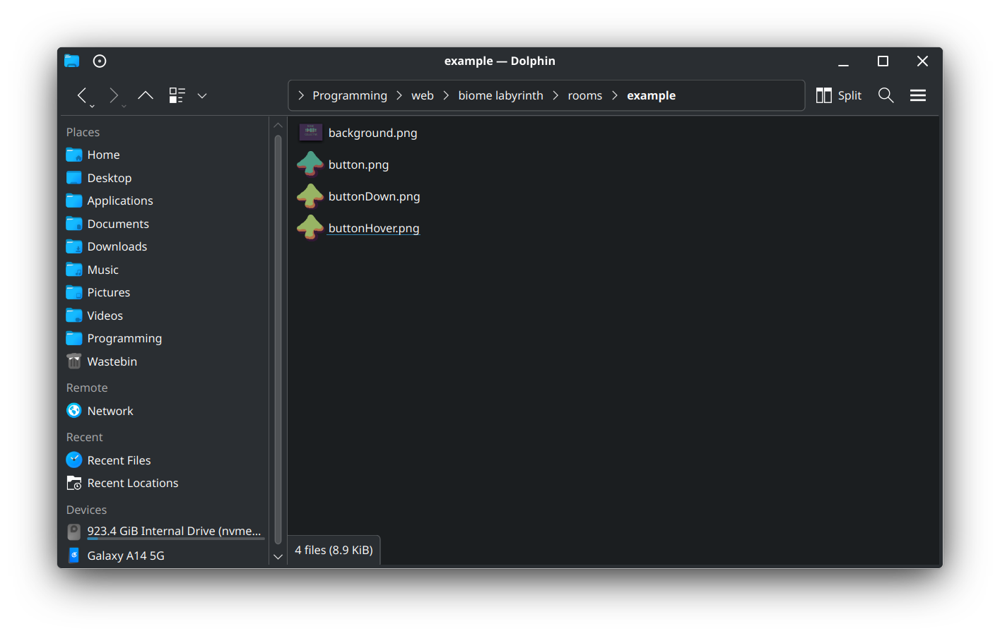

# Adding a room to the labyrinth
Adding a room to the Biome Labyrinth is fairly straightforward, but does involve
a few more steps than a more complex system like WordPress. And because we
currently rely on GitHub for hosting, the following steps do assume you're
familiar with [Git](https://git-scm.com/). If you'd like to contribute a room
but are not familiar with Git, talk to Niall for an intro.

- [Prerequisites](#prerequisites)
- [Room preparation](#room-preparation)
- [Running the test server](#running-the-test-server)
- [Creating the room](#creating-the-room)
- [Making your room public](#making-your-room-public)

## Prerequisites
As the Biome Labyrinth is essentially a static site, before you can add a room
you will need to obtain a copy of the current site. At the time of writing the
Labyrinth is hosted on GitHub; you can obtain a copy of it by cloning the
repository at [https://github.com/biomecollective/biome-labyrinth/](https://github.com/biomecollective/biome-labyrinth/)

Terminology: What does "cloning the repository" mean?

**"Cloning the repository"** is Git terminology for obtaining a full copy of the
project, with a full history of all of the changes and additions over the course
of the project's lifespan. Once you have cloned a repository you can modify its
contents, add to them, and push any changes back to the server so that everyone
working on the project can obtain the changes you have made and add them to
their copies of the project.

**How** you clone the repository will be different depending on what Git
software you are using.

**TODO: What Git UIs are people using? It would be good
to have some recommendations here.**

## Room preparation
Now that you have your own copy of the Labyrinth you can start adding rooms to
it. Before you can create the room itself you will need to gather any images you want to use for it and create a folder for the room to live in.

Info: What makes up a room in the Labyrinth?

Rooms in the Biome Labyrinth consist of the following elements:

- A **folder** in the `rooms` directory of the repository.
- A **background image** (jpg, png, gif, or any format your web browser can display).
- **Images for any buttons** in the room (again, any format your web browser can display).
	- Note that buttons can have up to 3 images: a regular image, an image displayed when the mouse is hovering over it, and an image for when the button is clicked/held down.
- A **room.json file**. This tells the Labyrinth how render the room and where to place the buttons etc. `room.json` will be created by the room editor; see
[Creating a room](#creating-a-room) below.
- (optional) A **javascript file** for any custom scripting you want to do in the room.

### Steps

1. Create a folder for the room in the `rooms` directory. Note that the folder name will make up part of the URL used to navigate to the room in a web browser.  
So a room called `example` would have a URL `https://biomecollective.github.io/biome-labyrinth/?room=example`.  
**Note:** this means the folder name will need to be lowercase and have no spaces (e.g. `Example Room` would have to be written `example-room`).
2. Gather any images you want to use, and put them in the folder you've created.

You should end up with something a bit like this:

## Running the test server
In order to edit your room and test that it's working as intended, you will
need to serve the labyrinth pages from a web server running on your own
machine. If you're on Windows or Linux there is a simple web server included in the repository for this purpose.

- To run the server on **Windows**, double-click the `WebServer.bat` file.
- To run the server on **Linux**, run the `WebServer.sh` script.
- If you're on **OSX** you will need to obtain a web server app yourself, and
tell it to serve files from the `biome-labyrinth` folder.

Once running, you can view the labyrinth in your web browser at
[http://127.0.0.1:8000](http://127.0.0.1:8000).

When you're done you can stop the server by navigating to
[http://127.0.0.1:8000/stop](http://127.0.0.1:8000/stop).

**Note:** The included server is very simple and only intended for local testing
of your rooms. Please don't use it to serve websites publicly on the internet.

## Creating the room
TEXT

1. Open the room editor
2. Select your room directory
3. Drag in your background image
4. Edit main room settings
5. Drag in your first button image
6. Edit your button settings

## Making your room public
TEXT
